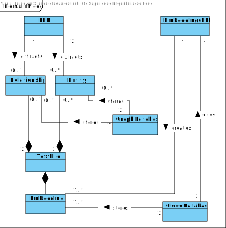
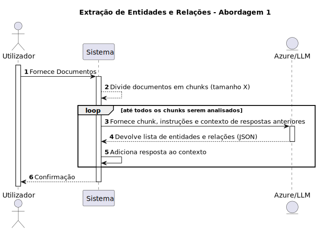
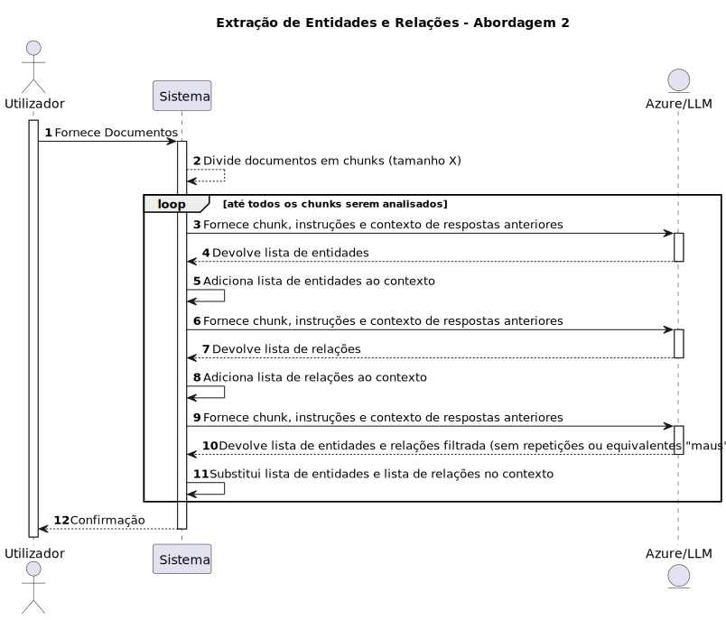

# Projeto Estágio Curricular ARMIS

Implementação de sistema RAG com Graph Database.

## Modelo de Domínio

## Extração de Entidades e Relações
### Abordagem 1
Nesta abordagem é pedido ao LLM que consiga extrair as entidades e relações num único passo, seguindo as mesmas instruções.

Cada ficheiro é dividido em chunks de tamanho X e processados separadamente.

No processamento de um chunk, todas as entidades e relações já extraídas anteriormente são fornecidas ao LLM para contexto.

### Abordagem 2
Nesta abordagem é pedido ao LLM que extraia as entidades e as relações separadamente.

Inicialmente é feita a extração de entidades. É também pedido ao LLM para as categorizar nas seguintes categorias:

- Seres Vivos 
- Objetos 
- Lugares e Espaços 
- Eventos e Processos 
- Organizações e Instituições 
- Conceitos e Ideias 
- Propriedades e Qualidades 
- Tempo e Quantidades

Após a estração de entidades estar concluída, é pedido ao LLM para extrair as relações existentes entre essas mesmas entidades. 

É ainda feita uma terceira passagem do LLM para garantir que não existem entidades e relações repetidas ou entidades com nomes diferentes que se referem à mesma coisa.

Cada ficheiro é dividido em chunks de tamanho X e processados separadamente.

No processamento de um chunk - todas as entidades e relações já extraídas anteriormente são fornecidas ao LLM para contexto, respeitando as fases acima explicadas.

## ENDPOINTS

### GET: /chat/make-question

Makes a question and provides the answer.

### GET: /favicon.ico

Gives the icon.

### POST: /files/import-file

Saves file to filesystem.

### GET: /neo4j/import-file

Imports nodes and relationships from a given file to neo4j.

### GET: /neo4j/import-nodes

Imports all nodes to neo4j.

### GET: /neo4j/import-relationships

Imports all relationships to neo4j.

### GET: /neo4j/get-all-nodes

Retrieves all nodes to neo4j.

### GET: azure/extract-entities-and-relations

Extracts all entities and relationships using an LLM.

