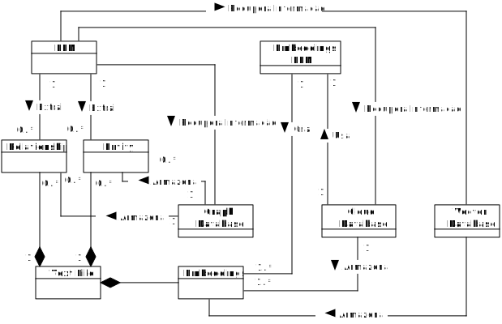
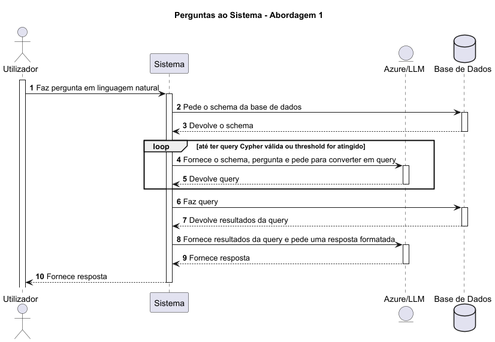

# Projeto Estágio Curricular ARMIS

Implementação de sistema RAG com Graph Database.

## Modelo de Domínio

## Extração de Entidades e Relações
### Abordagem 1
Nesta abordagem é pedido ao LLM que consiga extrair as entidades e relações num único passo, seguindo as mesmas instruções.

Cada ficheiro é dividido em chunks de tamanho X e processados separadamente.

No processamento de um chunk, todas as entidades e relações já extraídas anteriormente são fornecidas ao LLM para contexto.

O resultado final é um JSON com uma lista de entidades e uma lista de relações. O schema desta resposta é definido num JSON.

### Abordagem 2
Nesta abordagem é pedido ao LLM que extraia as entidades e as relações separadamente.

Inicialmente é feita a extração de entidades. É também pedido ao LLM para as categorizar nas seguintes categorias:

- Seres Vivos 
- Objetos 
- Lugares e Espaços 
- Eventos e Processos 
- Organizações e Instituições 
- Conceitos e Ideias 
- Propriedades e Qualidades 
- Tempo e Quantidades

Após a estração de entidades estar concluída, é pedido ao LLM para extrair as relações existentes entre essas mesmas entidades. 

É ainda feita uma terceira passagem do LLM para garantir que não existem entidades e relações repetidas ou entidades com nomes diferentes que se referem à mesma coisa.

Cada ficheiro é dividido em chunks de tamanho X e processados separadamente.

No processamento de um chunk - todas as entidades e relações já extraídas anteriormente são fornecidas ao LLM para contexto, respeitando as fases acima explicadas.

O resultado final é um JSON com uma lista de entidades e uma lista de relações. O schema desta resposta é definido através da biblioteca pydantic.

## Pesquisa na Base de Dados

### Abordagem 1
Nesta abordagem, o LLM sabe qual é o conteúdo da base de dados "de uma forma declarativa", isto é, ele não tem acesso diretamente à base de dados, apenas tem acesso ao schema.

O schema pode ser caracterizado como uma "blueprint" da base de dados, indicando apenas quais são as relações e o tipo da entidade.

O objetivo do LLM é analisar o schema e formar uma query em chyper válido que responda à pergunta em linguagem natural.

No final, os resultados da query são interpretados e é formatada uma resposta em linguagem natural.

### Abordagem 2
Esta abordagem usa a biblioteca Langchain e a sua implementação.

Na teoria e prática é igual, mas está mais otimizada a nível de utilização de tokens.

Uma melhoria seria permitir ao LLM fazer várias chamadas à base de dados, com diferentes queries e não apenas uma.

## ENDPOINTS

### GET: /chat/make-question

Makes a question and provides the answer.

### GET: /favicon.ico

Gives the icon.

### POST: /files/import-file

Saves file to filesystem.

### GET: /neo4j/import-file

Imports nodes and relationships from a given file to neo4j.

### GET: /neo4j/import-nodes

Imports all nodes to neo4j.

### GET: /neo4j/import-relationships

Imports all relationships to neo4j.

### GET: /neo4j/get-all-nodes

Retrieves all nodes to neo4j.

### GET: azure/extract-entities-and-relations

Extracts all entities and relationships using an LLM.

